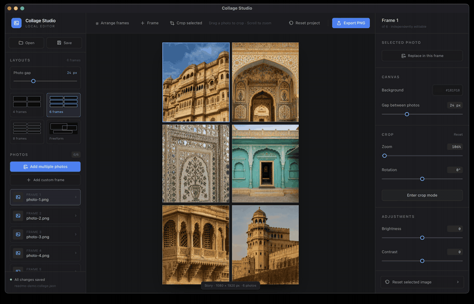

# Collage Studio

A local-first Tauri desktop editor for creating Instagram Story collages COZ I COUNLDN'T FIND AN EXISTING SIMPLE APP! It uses a 1080 × 1920 Story canvas, independently editable frames, nondestructive crop controls, project save/open, and full-resolution PNG export.

Photos are read from their existing local paths. The app never modifies the source files, has no backend, and makes no network requests.



## Current features

- Native multi-photo JPEG, PNG, and WebP picker
- Story-first layouts for 4, 6, or 8 photos, plus freeform
- Edge-to-edge Story grids with adjustable spacing only between collage photos
- Custom frames that can be moved and resized without disabling the starting layout's gap control
- Smart snapping to the canvas center, margins, and other frame edges or centers
- Separate Fabric.js frame, clip path, transform, and filter state for every photo
- Click-to-select, double-click-to-arrange frames, and explicit photo crop mode
- Mouse-wheel and slider zoom
- Rotation with automatic cover constraints (no exposed frame areas)
- Brightness, contrast, and saturation adjustments
- Per-frame photo replacement, selected-image reset, and complete-project reset
- 100-step undo/redo history with `Cmd/Ctrl+Z` and `Cmd/Ctrl+Shift+Z` shortcuts
- Serializable `.json` project save/open with source paths, frame geometry, transforms, filters, and export settings
- 1080 × 1920 PNG export, independent of the displayed editor size

Folder browsing, thumbnail generation, carousel pages, and JPEG/custom-size export remain deferred to later milestones.

## Download and run on macOS

1. Open the [Collage Studio releases page](https://github.com/Jonathan1599/insta-collage/releases) and select the latest release.
2. Download the `.dmg` file. The current `aarch64` build supports Apple Silicon Macs (M1, M2, M3, M4, and newer), not Intel Macs.
3. Double-click the downloaded DMG, then drag **Collage Studio** into the **Applications** folder shown in the installer window.
4. Eject the **Collage Studio** disk image and launch the app from your Applications folder.

The current build is ad-hoc signed rather than Apple-notarized. On first launch, macOS may block it because the developer cannot be verified. Right-click **Collage Studio** in Applications and choose **Open**, or go to **System Settings → Privacy & Security** and choose **Open Anyway**. You only need to approve a particular build once.

## Prerequisites

- Node.js 20 or newer
- Rust stable toolchain (Cargo 1.85 or newer)
- [Tauri 2 platform prerequisites](https://v2.tauri.app/start/prerequisites/) for your OS

## Setup

```bash
npm install
```

## Run the desktop app

```bash
npm run tauri dev
```

The regular Vite command (`npm run dev`) can render the interface in a browser, but native open/save/export actions require the Tauri desktop runtime.

## Checks and builds

```bash
npm run check
npm run lint
npm run build
npm run tauri build
```

## How to use

1. Choose the **4 frames**, **6 frames**, **8 frames**, or **Freeform** Story layout.
2. Use **Photo gap** in the left sidebar (or **Gap between photos** in the inspector) to adjust grid spacing. Added custom frames keep their individual position while the underlying grid gap changes. A true Freeform layout is positioned manually.
3. Click **Add multiple photos** and choose images. A grid automatically expands from 4 to 6 or 8 frames when needed.
4. Click **Add custom frame** or **+ Frame** to add a centered frame without discarding the existing frames. Arrange mode starts automatically.
5. In Arrange mode, drag or resize the selected frame. Cyan guides and a status label show when its center or edges align with the canvas or another frame. Click **Finish arrange** when done.
6. Outside Arrange mode, drag directly inside a populated frame to reposition its photo and scroll over it to zoom. Double-click a frame to enter Arrange mode. Use **Crop selected** for the dedicated stationary-frame crop mode; the inspector also provides **Zoom** and **Rotation** sliders.
7. Press `Escape` or **Finish crop** to leave crop mode. Each frame retains its own crop and adjustments.
8. Use **Undo** / **Redo**, `Cmd/Ctrl+Z`, or `Cmd/Ctrl+Shift+Z` to move through project edits.
9. Use **Save** (or `Cmd/Ctrl+S`) to write a local project JSON file.
10. Choose **Export PNG** to write the full 1080 × 1920 Story image.

Saved projects reference the original image path, so keep the source photo in place if you want the project to reopen without relinking it.

## License

This project is licensed under the [PolyForm Noncommercial License 1.0.0](LICENSE). Commercial use is not permitted. This is a source-available license, not an OSI-approved open-source license.
